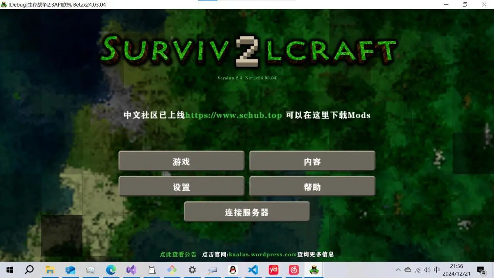

# 生存战争2.4 NET联机版客户端发布页面

[English](README_en.md) | [Русский](README_ru.md)

## 项目简介

本项目旨在给生存战争（Survivalcraft）NET版完善完整的联机功能，让玩家能够在同一世界中进行游戏、建造和探索。项目基于C#开发，支持多平台（Windows、Android、Linux、预计Macos、Ios）。

## 发布页面
http://schelper.trk34.top:34340/updater.html

## 项目地址
开发项目地址
https://cnb.cool/trk34Organization/sc2.2network

正式版本发布地址
https://cnb.cool/trk34Organization/sc2.2publish

fork发布地址
https://cnb.cool/YYLMZXC/sc2.2publish

GitHub发布地址
https://github.com/survivalcraft-net/survivalcraft-net

GitHub Pages
https://survivalcraft-net.github.io/

## 当前版本：2.4
SCNETx26.02.05

## 上次提交时间
2025年02月26日

### 项目更新与反馈

#### 项目更新
- 我们会定期更新项目，修复bug并优化功能
- 最新版本信息可在项目首页查看
- 重要更新会通过Git Release发布
- 建议玩家定期检查更新，获取更好的游戏体验

#### 问题反馈
1. 发现bug后，通过创建Issue汇报（使用bug标签），描述bug现象和复现步骤
2. 功能建议请使用feature标签提交Issue

### 客户端连接方式
1. **局域网连接**：直接搜索局域网内的服务器或输入IP地址连接
2. **虚拟局域网**：使用第三方软件（如向日葵、蛤蟆吃）创建虚拟局域网后连接

## 注意事项

- 跨平台联机时请注意版本兼容性
- 服务器性能会影响支持的最大玩家数量
- 网络质量对游戏体验有显著影响，建议使用稳定的网络连接

##  云盘

蓝奏云盘
https://yylmzxc.lanzouu.com/b0pnfhqbi
密码:sc

谷歌云盘
https://drive.google.com/drive/folders/1yOkstyNNDWJ9VbOKgDH8CqgnlzdiwnyG?usp=sharing

mega云盘
https://mega.nz/folder/AaUhxDDL#fAm67H7Nl6PuaebzQhXBAQ

##   链接

服务端管理群
qq893387376
点击链接加入群聊【联机服列表管理办事处.】：
https://qm.qq.com/q/mT1vqQ0JV0

联机mod制作
qq1063334551
点击链接加入群聊【联机开发mod插件交流】：
https://qm.qq.com/q/D3e6wA5jP4

mod总开发群
qq638052328

Telegram:
公告
https://t.me/sc2netg

聊天
https://t.me/sc2net

Discord：
discord为Survivalcraft总群，并没有单独创建
discord发布在改分组下，你需要获取相关权限才能查看
https://discord.com/channels/325662319306735625/1471844299917230304/1471844299917230304

## 历史更新日志
### 目前版本：
### SCNETx26.02.05
更新内容：

### 历史版本：
### x24.03.04b7
Survivalcraft x24.03.04b7更新公告

时隔9个月的咕咕咕，联机版迎来了新的更新，这次更新是2.3的稳定版本，也是2.3的最后一个更新版本，主要修复了一些比较严重的问题，添加了模组自动加载功能（需服务器支持）

更新内容：
1.修复联机版列表乱跳的问题
2.修复了几处崩服bug
3.修复了Android10进游戏异常的bug
4.修复游戏内社区注册地址无效的bug
5.重装游戏不会丢号
6.模组安装无需手动排序
7.修复了进服时卡顿的bug
8.修复俄语字体的显示问题
9.修复利用领地石刷物品的bug
10.进服加载模组功能(需服务端支持)
11.添加了国际列表服务器地址
12.调整了服列表的位置
13.当服务器未安装模组时会自动卸载模组

至于大家最关心的2.4联机版也在火速开发中，目前已经同步了一些贴图，可以看图：

下载地址：
电脑版：wwcn。lanzouv。com/iEQ4s2iqyj1g
手机版：wwcn。lanzouv。com/iAYkY2iqyl6d
手机版下载密码:aks2

### x24.03.04
一个月的时间，我们将原版2.4的大部分的特性移植到了到联机版中
除此之外我们还额外开发了以下内容：
优化地形：额外的盆地地形以及更加庞大的洞穴地形
极冻高原地形：高原占领了整个世界！蛛网般的洞穴和溶洞贯穿天地。植物和泥土变得稀缺
修复了夏季树叶有时会掉落秋季树叶的bug
由于现在还在公测阶段，bug较多请见谅
2.4联机版本暂不兼容2.3的老模组
电脑版下载地址：
https://wwcn.lanzouv.com/iUi1y2l63lcb
手机版下载地址：
https://wwcn.lanzouv.com/i3jGO2l63iri
密码:gzm8

### 2023联机发布会
前言：
SC 2.2API 中文联机版制作工作于2021年1月正式启动，成立了以小小怪、lixue为核心的联机制作组。经过漫长的开发与测试，在修复了多个影响生存的严重bug后，制作组认为，发布联机的时机已经成熟，但是不代表没有bug了，如果觉得不满意，请右转mc联机。联机仍有一段很长的路要走，制作组目前也在全力修bug，希望各位保持积极的态度，共同见证sc联机的成长。

版本说明：
目前联机有很多个，本贴仅针对sc中文社区发布的联机版本做说明。联机基于API1.32开发，游戏版本为2.2，但是已经同步2.3的部分游戏内容，包括存档优化与音频修复，可以当做2.3游玩。有安卓版和电脑版，鸿蒙也可用，但是没有ios版，部分安卓设备可能不支持。
联机作为独立API，后期可能会开放mod接口，虽然目前个别mod加了可以使用，但总体来说，联机暂时不支持mod，不建议尝试。

联机规则：
对于公开服务器，为了维持游戏环境，特制定以下规则，望各位玩家自觉遵守，违规情节严重将考虑采取强制手段禁止游戏。
1.团结友爱，互帮互助。
2.禁止未经其他玩家同意就拆除，破坏其他玩家建筑的行为。
3.禁止以任何形式的恶意卡服，炸服，攻击等。
4.禁止发表不当言论，建造不符三观的建筑。
5.未经同意，不随意翻动，盗取他人物品。
6.不得在地表使用地形破坏工具，如炸药桶。
7.禁止恶意pvp。
8.发现bug请及时上报处理。
规则内容暂定，后续会根据实际情况做调整，也请留意服务器提供者制定的规则。

联机违规举报

特别说明：
本联机制作组属于玩家社区组织，不代表生存战争官方！生存战争（Survivalcraft）版权及其他合法权利全部属于生存战争作者Kaalus，请广大玩家正确区分，不要传播错误概念误导他人。
目前并没有由联机制作组搭建的所谓的联机官网或单独的QQ频道，公开的联机交流群下面会提供，其他的皆为假冒。联机文件为免费获取，此类非官方渠道可能存在诈骗风险，请小心防骗。
联机模组仅供游玩体验，喜欢这款游戏请从微软应用商店或谷歌商店等渠道购入正版，支持游戏作者。如果想支持联机开发，可到sc中文社区打赏。

下载方式：
建议到以下渠道获取联机文件，其他平台不保证安全性，且提供的不一定是最新的联机版本。
1.SC中文社区mods百科联机发布页
2.联机交流群（QQ，没有微信）：
①1011032552
②337335474
3.其他合作的生存战争交流群。
4.（备用）蓝奏云下载：点击这里
密码：3sgl
教程攻略：
这里会更新联机的相关教程，以及一些常见的问题解答。也希望广大玩家可以到社区的联机板块贡献力量，帮助玩家解答疑惑https://m.schub.top/com/cate/3

加入我们：
联机开发十分不易，每一步都是攻坚克难，加上开发者没有太多的时间与精力投入其中，所以正式版联机不敢保证。但是你们的热情与支持影响着联机的发展，如果你有能力有意愿，欢迎加入联机制作组贡献力量，争取早日推出稳定版本。
满足以下条件且有意愿加入的玩家，可以加上述联机交流群，联系管理员。
0.热爱游戏，热爱生存战争。
1.基本掌握C#。
2.了解entity component的设计思维。
3.熟悉网络开发。

### x23.01.31

1.目前最新版本是x23.01.31。
2.修复了关闭服务器时玩家携带的物品丢失的bug。
3.增加了服务器限制方块行为的功能。
4.领地石合成要求改为游戏角色等级达到5级。

服务器消息：
1.微笑服旧版本存档已迁移至新版本。
2.微笑服的所有服务器已限制刷石机，不要再企图用它刷经验了。
3.遗忘服添加自动重启插件，服务器崩后悔自动重启，如果一分钟后没有自动重启再在群里反馈。

（备用）蓝奏云下载地址：https://wwi.lanzoup.com/b01eg91mj
密码:3sgl

### x23.01.14

01.13版：

1.修复了AddPlayerData中的GC导致异常卡住问题
2.修复了在线人数检测限制
3.修复了部分情况下挖不了方块问题
4.修复了睡觉闪退问题
5.修复了手动添加的服务器不能保存问题
6.增加了资源包校验机制
7.解决了MovingBlock的同步
8.解决了主玩家能听到附近玩家的UI提示音的问题
9.服务器管理员可随意破坏领地石
10.增加了禁用方块放置与合成功能
11.解决客户端动物隐形问题
12.电脑端增加消息发送快捷键Tab
13.生存10天解锁领地石配方,挖掉原来的领地石后才能放置新的
14.修复创造模式飞行状态，改为生存后的Bug
15.自定义随机出生点，睡觉时的体力恢复系数
16.修复衣服等级限制导致物品消失问题
17.修复禁止重生后的错误
18.禁止近战攻击队友，但能远程伤害
19.默认关闭Mod加载功能，如有需要，在设置中开启Mod加载，若因为添加mod导致游戏出现问题，请玩家自行解决，制作组概不负责
20.服主增加黑名单移出功能

01.14版：
1.修复打开箱子、熔炉等可互动存储方块所有玩家都会同时打开的bug
2.修复弩箭在发射后被吞的问题
3.修复玩家等级与主机之间不同步问题

由于社区暂时无法下载文件，获取文件请加联机Q群975814555

### 2.2［x23.01.01.2］

2.2联机版为独立版本

本次更新内容
1.修复了客户端爆炸没爆炸声音
2.解决了修改电池电压报错
3.修复了储存器修改界面
4.解决了骑马四处移动概率出现马回到几秒前的位置，人物下马
5.暂时去掉了PlayerStats同步
6.服务器玩家出生点随机生成
7.优化玩家列表，自动选择显示层级